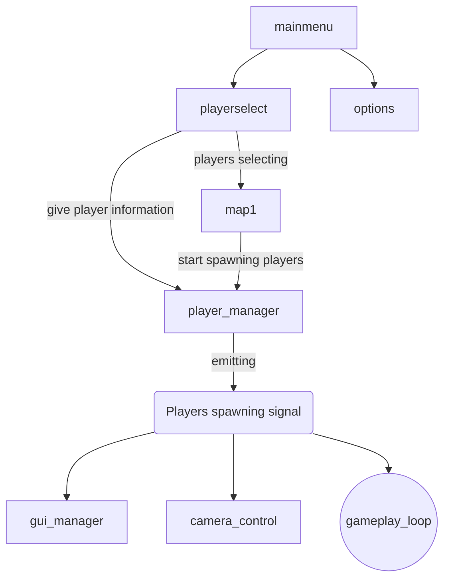

# The Legend of Beef

Todo currently:
	coin counter fix on buy -> fixed
	wall only cache cluster - FIXED
	room scaling -> WIP
	Shop scaling
	shop coin scaling lower start
	shop price red if to expensive
	enemy hole knockback to not enter instantly
	
	
## Todo List
- Gameplay Loop
	- Survive
		- fixed time?
			-> if at least 1 survives until time -> round over in good
		- Fight enemies
			-> pickup one weapon.
	- die
		-> freeze time
		-> zoom into dying player
		-> slow tilt back into dying
		-> revive with beer time!
		-> if all die, round over in bad
	- round over 
		-> move to leaderboard
			-> cheer with beer!
			-> try again, change mode
		
- Mainmenu + 
  - Characterselect
	- Controller select + 
	  - Button1 to join + 
	  - left-right to adjust usual beer time ~5min steps    => 30 min
	  - button2 to leave
	- Character select
	  - left right to swap a ring menu?
  - Levelselect
  - Options
	- Sound
	- Music
- Leaderboard
  - Players over every match
  - Crown for first Place
  - Doodoo for last Place
  	- stats: 
		- Deaths?
		- Kills?
		- Damage?
- Mechanics
  - Characters
	- Global autoload character/player singleton
	- Spawn players on level load with correct controls
	+ animate
	+ turn sprite on turn
	- stuff to keep track of:
		+ Health
		+ is_dead
		+ is_frozen
		+ player slot 1-4
		- Beer Fatigue percentage
		- Beer count
		- Powerup state (active, time remaining)
		- Powerup count each
		- Beerlevel (in ml)
		- revive count
		+ Weapons
		- Raise Beer/Hand (activate timer (1s))
  + Camera movement
	+ Keep players in view
  - Allies
	- Turrets?
	- Walls
	- Bushes
		- If no player visible, smell guy with the most beer and target
		- if lost vision 3 times in a row to the same bush, nuke the bush (aoe bomb throw), removing the bush
  - Monsters
	- Different movesets
	- Shooting?
	+ Spawn areas
		- Thrown in the cage?
			-> start animation without movement
			-> random place
			-> indicator where it lands?
				-> red circle with shadow that gets bigger?
		+ Spawn hub?
	types:
		Small monster
			Runs straight at visible player
		Duck
			Faster enemy that flies at visible player
		Ghost
			Slow enemy that phases towards player
			can move through enemies
		Bomb driver (mario kart)
			drives in a circle, explodes on contact
		Protestor
			Throws rocks at player location from a safe distance
			moves to safe distance first 
			2 second air time + red area indicator
		Golem/Robot
			Healthbar
			Slow Boss
			Big health, big damage
		Mortar Dick
			Healthbar
			Immobile Enemy
			Big Health, only Range Damage
			shots big shots, aoe, 1s airtime
		
		
  - BEER TIME
	- Rotating modes!
		- just drink as much as you want (default)
		- Bonus rounds (All in bushes -> 1 second timer -> "Camping" | xxx)
			- Drink Professionally
				drink an exact amount of beer (100g, 150g, 200g)
				50% off 	-> 0% success
				0% off 		-> 100% success
			- FINISH HIM! (maximum 2times per session)
				Finish the drink
				if success 		-> benefit the percentage to both
				if fail			-> get max beer fatique until finished 
			
	- Voting
	- Pause
	- Refill
		Flow:
			- select size (up/down 1s, left/right 10s, B2 + left/right 100s, B1 accept)
		- when empty? 
	- Powerups
		- Bierkönig
			drank more than average (see balancing) 
			Flavor text: You feel invincible
			lasts 5 minutes ? always same time? (start when unpaused)
			15% * Bierkönig less damage taken
			15% * Bierkönig more movementspeed
			15% * Bierkönig aiming offset (random left-right offset)
		- Cracked open a new one
			opened a new beer
			Flavor text: Proud owner of a fresh new beer
			lasts 5 minutes (start when unpaused)
			10% more damage
		- Alcoholic
			Drank a certain amount (see balancing)
			lasts 5 - (1min * (Alcoholic-1) ) minutes
			25% * Alcoholic more damage
			
	- Balancing: (percentage over all players)
		- revive
			250ml * revive
			250ml, 500ml, 750ml ....
		- Bierkönig (% mehr als der Durchschnitt)
			- Per person
			100ml * Bierkönig pP
			100ml over, 200ml over, 300ml over ...
		- Alcoholic:
			250ml + 100 * alcoholic
			250ml, 350ml, 450ml, 550ml
	- Beer fatique!
		- hold B2 to raise hand (swiggle beer over head?)
		- min 2 players must accept
		- beer pause
	- Results:
		- percentage drank
		- mini crown for best performance
		- amount of benefit to the main guy
	- Flow
		- Pause flow -> "is_frozen"
		- overlay in animation
		- weight bottle; hold B1 to confirm
		- drink 
			- optional refill (hold B2)
				- weight bottle (for first part of drink) -> save as first part
				- select new size (ml)
				- weight bottle
				- resume drink
		- Weight bottle again; hold B1 to confirm
		- Results table (summarize all parts cause optional refill)
		- add benefit to people
		- B1 to confirm resume
		- remove overlay
		- slow unpause?
  - Items
	- Health pickups (slow HoT only)
  - Weapons
	+ only one weapon?
	upgrades?
	Types:
	+ Sword
		Swing in arc 105°? 
		middle range
		aim at closest enemy
		middle damage + middle knockback
	Gun
		Shoots bullet at nearest enemy
		infinite range
		only damage
	Baseballbat
		Swings in arc 105°
		middle range
		low damage + high knockback
		returns flying projectiles
	Fists(gloves)
		straight, fast punches
		low range
		middle damage + high knockback
	Daggers
		straight stabby stabby
		low range + high frequency
		high damage + momentum slowdown
	Spear
		Straight stabby stabby
		high range + middle frequency
		high damage + low knockback
	Surströmming
		Leave trail of stinky clouds behind (small, low-life cloud areas doing damage over time)
		lingers for 4-5 seconds
		Damages self after 1 seconds (no standing still)
		low damage dot
	Slingshot
		Press B1 to to place pole, hold B1 and move around to pull the sling, release b1 to shoot
		damage and knockback depends on pull
		movespeed gets reduced the farther away from the pole we get
		Pierce effect at a specific draw distance?
	Shield
		Neglects Contact and projectile Damage
		Hold B1 + aim for adjusting the angle
		Reflects Projectiles
		only one shield on the map
		Throw molotov at player when trying to hide in the corner (burning AOE damage area)
	Running Shoes
		Running Speed + 40%
	Beyblade
		Hold B1 and spin the stick to charge (remember spinning direction? for knockback add?)
		more charges -> faster spin -> more time
		pulls towards center of the map when spinning
		low friction, bounces more back from contact
		loses spin speed on contact and slowly over time
		Damage depends on spinning and movement speed
		can be picked up after it stops
	Molotov
		Press B1 to light the fabric. move stick to aim area. press B1 to throw
		Fire AOE area that lingers 5 seconds
		1 second Air Time
		0.25 seconds lighting time
		damages all players and enemies *duh*
	
  - GUI
	+ Button Icons all over the place
	- Player stats
	  + Health
	  + Name
	  - Beer Fatique
	  - Weapon
	  - Icon
	  - Timer?
	  - Beercount!
	  - Beerlevel!
- Levels
  + spawn in animation
  + start timer
  - scale?
  + better background color theme
  + Boundaries + 
  - Stage hazards?
  - stage velocities
- Sound
  - Effects
  - Background music
- graphics
  - sprites
  - background
  - Logo
  - Items
  - Playerfaces
  - System for color coding!
		Red is bad
			AOE areas with outer circle and inner circle that grows to damage area
			Bullet outline
			enemy outlinen
		Green is healthy
			Health pickups outline
			Shield pickup outline
		Yellow is interactible
			Weapon Pickup outline
			levers?

# Checks
 - move animation state from one scene to the next? mainmenu -> character select
 - classes for players?
 - dynamic property names -> get(string)
 - dynamic function/methods -> call(string)
 - Array index in loop -> not easy, probably better to stay at 0 indexed or other stuff

## Global scripts
scene_switcher -> loading only scenes
player_manager -> checks for inputs, manages active players and emits signals for players and player stuff
gui_manager -> is invoked via player_manager signals so far
camera_control -> positioned inside the map scenes currently. is updated when players are spawned

## order sketch

Scaling ideas:
	Ground level n 
		-> enemy health 	= 100% + n * 10% ?
		-> enemy damage 	= 100% + n * 10% ?
		-> enemy speed 		= 100% + n * 10% ?
			-> level 10 200% stats
			-> level 20 300% stats
		enemy tiers?
			-> Tier Levels increase chance of higher tiers?
			-> tier levels increase every x ground levels
				-> tier 1 
					groundlevel 1-4 
					level 1 100%
					level 2 110%
					level 3 120%
					level 4 130%
				-> tier 2 
					groundlevel 5-8
	shop prices
		3 items at base
		reroll -> 10 coins * rerolls
			10, 20, 30, 40, 50
			
		
	Time scaling? 
		
	
