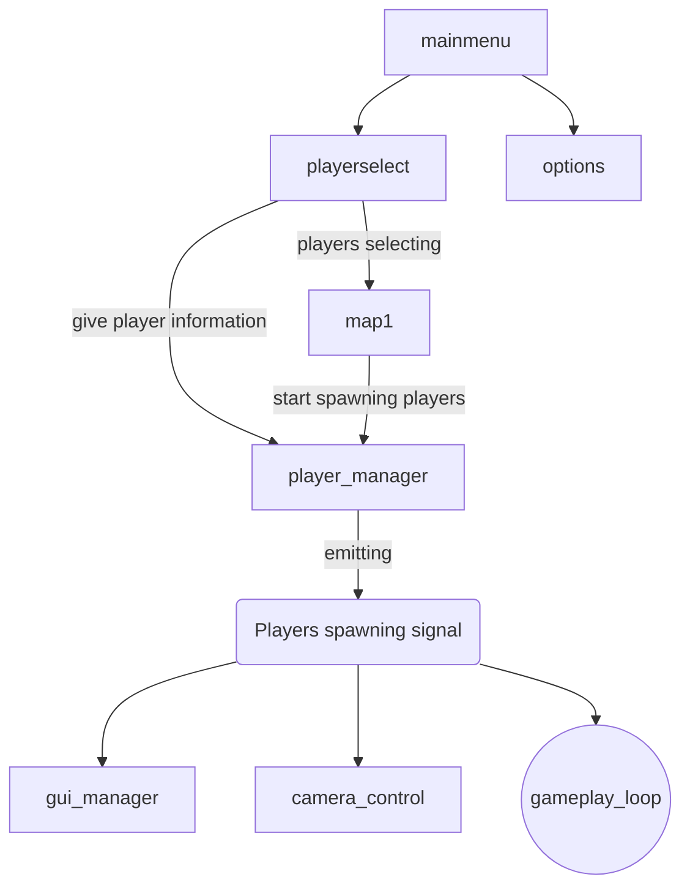

# The Legend of Beef

## Todo List
- Gameplay Loop
	- Survive
		- fixed time?
			-> if at least 1 survives until time -> round over in good
		- Fight enemies
			-> pickup one weapon.
	- die
		-> revive with beer time!
		-> if all die, round over in bad
	- round over 
		-> move to leaderboard
			-> cheer with beer!
			-> try again, change mode
		
- Mainmenu + 
  - Characterselect
	- Controller select + 
	  - Button1 to join + 
	  - left-right to adjust usual beer time ~5min steps
	  - button2 to leave
	- Character select
	  - left right to swap a ring menu?
  - Levelselect
  - Options
	- Sound
	- Music
- Leaderboard
  - Players over every match
  - Crown for first Place
  - Doodoo for last Place
  	- stats: 
		- Deaths?
		- Kills?
		- Damage?
- Mechanics
  - Characters
	- Global autoload character/player singleton
	- Spawn players on level load with correct controls
	- animate
	- turn sprite on turn
  - Camera movement
	- Keep players in view
  - Allies
	- Turrets?
	- Walls
  - Monsters
	- Different movesets
	- Shooting?
	- Spawn areas
		- Thrown in the cage?
			-> start animation without movement
			-> random place
			-> indicator where it lands?
				-> red circle with shadow that gets bigger?
		- Spawn hub?
  - BEER TIME
	- Voting
	- Pause
	- Powerups?
	- Beer fatique!
		- hold B2 to raise hand
		- min 2 players must accept
		- beer pause
  - Items
	- Health pickups
	- Shield
  - Weapons
	- Sword?
  - GUI
	- Button Icons all over the place
	- Player stats
	  - Health
	  - Name
	  - Beer Fatique
	  - Weapon
	  - Icon
	  - Timer?
	  - Beercount!
	  - Beerlevel!
- Levels
  - spawn in animation
  - start timer
  - scale?
  - better background color theme
  - Boundaries + 
  - Stage hazards?
  - stage velocities
- Sound
  - Effects
  - Background music
- graphics
  - sprites
  - background
  - Logo
  - Items
  - Playerfaces
  - System for color coding!

# Checks
 - move animation state from one scene to the next? mainmenu -> character select
 - classes for players?
 - dynamic property names -> get(string)
 - dynamic function/methods -> call(string)
 - Array index in loop -> not easy, probably better to stay at 0 indexed or other stuff

## Global scripts
scene_switcher -> loading only scenes
player_manager -> checks for inputs, manages active players and emits signals for players and player stuff
gui_manager -> is invoked via player_manager signals so far
camera_control -> positioned inside the map scenes currently. is updated when players are spawned

## order sketch

